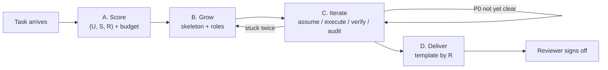

# Agent Work Frame

## 0. The Loop In One Picture

Every task flows through one pipeline. Read this section and you have the whole skill in your head; the rest is the *how* of each station.



Three axioms shape every station; later rules carry an `(A?)` tag pointing back here:

- **A1 — Directionality.** Information has direction. Roles split by who *produces* vs who *verifies*, never by who *executes*; mechanical work moves to the scalable side, judgment stays with the side that owns consequences.
- **A2 — Minimality.** Structure grows on demand. Default skeleton is the smallest one; new files appear only when a feature axis demands them.
- **A3 — Monotonicity.** On failure, grow knowledge, do not retune parameters. Convergence is guaranteed only by monotonic knowledge growth — stuck means step *back* to research, never *forward* to retry.

---

## A. Score the Task

**Station A** turns a free-form prompt into a `(U, S, R)` vector. The vector plus a budget tier decides everything at B and D. Default is `(0, 0, 0)`; raise an axis only when evidence demands. `(A2)`

### A.1 Three axes

| Axis | Question | 0 | 1 | 2 |
|------|----------|---|---|---|
| **U** Uncertainty | How much do human + Driver not yet know? | Materials self-contained | Some lookups / mild ambiguity | Domain unfamiliar, vague spec, or external research needed |
| **S** Structure | How non-obvious is the product's shape? | One module, one output | Multi-module but flat | Multi-stage with non-trivial sub-pipelines |
| **R** Risk / Formality | What is the cost of being wrong or under-documented? | Throwaway / explorative | Reviewer reads a summary | Graded, audited, irreversible, or formal deliverable |

Recipe (≤ 60 s): read prompt once → one evidence sentence per axis → emit vector → pin it at the top of `goal.md`. When unsure, choose the lower degree — ceremony you create at A is paid for at every later station. `(A2)` The always-on `has_artifact` flag (any output needing self-check) is not an axis; it just appends a self-check to every step.

### A.2 Dry-run budget

Before any file is created at B, the Driver previews `files=N, workers=M, ~tokens=T` and a tier is chosen — turning feature-stacking avalanche into a controllable knob. `(A2)`

| Tier | Cap | When |
|------|-----|------|
| **light** | All axes capped at 1 | Exploration; force simplification |
| **standard** | Axes used as scored | Default |
| **full** | Axes as scored; parallel Workers allowed | Only when R=2 *and* the task is genuinely large |

### A.3 Worked examples

| Task | Vector | Budget | Files that will grow at B | Template at D |
|------|--------|--------|---------------------------|---------------|
| Edit a single config line | `(0, 0, 0)` | light | None beyond `goal.md` + `STATUS.md` + `workspace/` | status-only |
| Refactor a multi-module library | `(0, 2, 1)` | standard | + `notes/overview.md`, `notes/sections.md`, `notes/plan.md` | one-pager |
| ICS course experiment (VGG19) | `(1, 1, 2)` | standard | + `notes/knowledge.md`, `notes/overview.md`, `notes/plan.md`, `notes/memory.md`, `workspace/REPORT.md` | academic-paper |
| Novel research with unclear scope | `(2, 2, 2)` | full | + above + `notes/assumptions.md`, `notes/references.md`, sub-overviews | academic-paper |

---

## B. Grow the Skeleton

**At station B** we materialize exactly the files and roles the vector from A demands — no more. Everything created here is scaffolding for C; the deliverable itself lives in `workspace/`, not `notes/`. `(A2)`

### B.1 Default skeleton — always exactly three

```
[task]/
  goal.md      # vector + I/O contract + P0/P1/P2 testpoints
  STATUS.md    # auto-projected snapshot, refreshed as last sub-step of each iteration (A1)
  workspace/   # actual deliverables
```

### B.2 Growth table — files appear by axis, not by ritual

| Trigger | New file(s) | Lifecycle |
|---------|-------------|-----------|
| `U ≥ 1` | `notes/knowledge.md` | append-only, schema in C.4 |
| `U ≥ 1` with cited sources | `notes/references.md` | append-only |
| `U = 2` | `notes/assumptions.md` | append-only audit log (C.1) |
| `S ≥ 1` | `notes/overview.md` | rewriteable; layers chosen by *cognitive distance* (B.4) |
| `S = 2` | `notes/sections.md` + `notes/overview-[X].md` | sections.md stable, sub-overviews rewriteable |
| `R ≥ 1` | `notes/plan.md` | only if the plan outgrows STATUS.md |
| `R = 2` | `notes/memory.md` + `workspace/REPORT.md` | memory append-only; REPORT built at D |

Classes: **STABLE** (`goal.md`, `sections.md`) need an inline Change Log on edit; **ACCUMULATED** (`knowledge`, `references`, `memory`, `assumptions`) are append-only, mark superseded but never overwrite `(A3)`; **MUTABLE** (`STATUS`, `plan`, `overview`) rewrite freely.

### B.3 Roles (tool-agnostic)

| Role | Owns | What they do |
|------|------|--------------|
| **Reviewer** | Judgment + consequences | Approves testpoints, signs off at D |
| **Driver** | Coherence | Plans, integrates, proposes testpoints, refreshes STATUS.md |
| **Worker** | Throughput | Long-horizon execution, deep codebase work, parallel sub-tasks |

Split is by *production vs verification*, not by *human vs agent* `(A1)`. Tool mappings in R.3.

### B.4 Product vs Process & Cognitive Distance

When both files exist they answer different questions and must not bleed: `overview.md` = static product ("what does the final system look like"); `plan.md` = temporal process ("first / next / parallel"). Layers in `overview.md` chosen by *cognitive distance*, not template `(A2)`:

| Distance between interface, computation, implementation | Write |
|---|---|
| Layers overlap; interface implies the rest | One layer |
| Moderate gap on one side | Two layers |
| Wide gap on both sides (novel math + engineering) | Three layers |

---

## C. Iterate

**At station C** we run a five-step cycle until all P0 testpoints clear. Each iteration declares its assumptions, then validates or falsifies them — this is what makes A3 enforceable rather than aspirational.

### C.1 The five-step cycle

```
1. assume   list >= 1 assumption this step depends on   -> notes/assumptions.md  (mandatory when U=2)
2. execute  do the step
3. verify   run testpoints (auto) or show Reviewer (manual)
4. audit    on FAIL -> identify the falsified assumption,
                       promote it to notes/knowledge.md  (A3)
            on PASS -> mark the assumption "validated"
5. project  refresh STATUS.md (current step, last result, open assumptions)
```

Reviewer involvement is confined to step 3 (manual verification only) and station D — A1 made literal.

### C.2 Stuck detection — A3 made operational

Same element fails twice with no new `knowledge.md` entry between attempts → loop is non-monotonic; stop, step back to A or B, never tune in place. This is the single rule that guarantees termination. `(A3)`

### C.3 Probe-then-fix sub-loop

For opaque environments (autograding, remote runners) prefer one probe over many guesses `(A3)`: (1) add debug output at entry points — CWD, dir listings, candidate paths; (2) submit / run once, read errors *and* debug output; (3) fix exactly one blocking issue, resubmit; (4) repeat until clean.

### C.4 Knowledge entry schema

`notes/knowledge.md` is append-only. Each entry: `(A3)`

```
### K-<short-id>  [<fact | inferred | speculation>]
- date: YYYY-MM-DD
- supersedes: K-... | none
- claim: <one sentence>
- evidence: <link | quote | repro snippet>
- impact: <which design decision this informs>
```

Never edit an old entry; add a new one with `supersedes:` and update downstream design notes.

---

## D. Deliver

**Station D** picks one of four templates by R. `notes/` is scaffolding, not deliverable — D's job is to translate scaffolding into a human-facing artifact (or explicitly skip when none is needed). `(A1)`

### D.1 Template by R

| Vector | Template | Output | Use when |
|--------|----------|--------|----------|
| `R=2` academic/course | **academic-paper** | `workspace/REPORT.md` | Graded experiment, formal write-up, P0/P1/P2 table required |
| `R=2` engineering | **engineering-handover** | `workspace/REPORT.md` | Production deploy, on-call handover, rollback plan required |
| `R=1` | **one-pager** | `workspace/SUMMARY.md` | Internal report, light research summary |
| `R=0` | **status-only** | `STATUS.md` final snapshot | Exploration / prototype; artifacts speak for themselves |

### D.2 Template skeletons

- **academic-paper** — Abstract / Problem Definition (I/O table) / Background & Related Work / Design / Method / Results (tables + ASCII viz) / Testpoint Verification (P0/P1/P2 expected vs actual) / Conclusion (verdict vs goal + falsified-assumption summary).
- **engineering-handover** — TL;DR / Architecture (current state, no history) / Deployment Surface (config, env, secrets, versions) / Runbook (start/stop, health, common failures) / Rollback Plan (executable, data-compat) / P0 Testpoints / Known Limitations / Owners & On-call.
- **one-pager** — Title + vector. *What we did* (2-3 sentences). *Key findings* (bullets). *Numbers / evidence* (one table or chart). *Open questions*. Total ≤ 50 lines.
- **status-only** — Final `STATUS.md` block: `Vector / Step: DONE / Last result / Artifacts / Open assumptions`. Reviewer reads `workspace/` directly.

### D.3 notes/ → section source map

```
goal.md                 -> Abstract + Problem Definition + Testpoint expected-values
notes/knowledge.md      -> Background / Key Concepts        (cite K-ids inline)
notes/references.md     -> Related Work / Prior Art
notes/overview.md       -> Design / Architecture
notes/plan.md           -> Method / Implementation Steps
notes/memory.md         -> Agent Collaboration Reflection
notes/assumptions.md    -> Conclusion: falsified-assumption summary
workspace/*             -> Implementation code refs + run-time numbers in Results
```

Translation rule: framework files are notes (fragmented, agent-oriented); the report is narrative (structured, human-oriented). Re-tell, do not paste. `(A1)`

**Sign-off:** Reviewer compares deliverable against `goal.md` + P0 testpoints. Pass = done. Fail = re-enter C at the failed P0 *with* a new `knowledge.md` entry explaining the gap. `(A3)`

---

## Reference

### R.1 Session handoff order

```
1. STATUS.md            -> sub-second context recovery
2. goal.md              -> objective + vector + testpoints
3. plan.md (remaining) / memory.md (last 3)
4. overview.md          -> only if S >= 1
5. knowledge.md         -> on demand
```
Context-constrained: STATUS.md + goal.md + last 3 plan/memory entries is the minimal viable load.

### R.2 Anti-patterns checklist

- Creating `notes/` files "just in case" — violates A2. Wait for the axis to score ≥ 1.
- Editing `knowledge.md` entries in place — violates A3. Append a superseding entry.
- Reviewer enumerating testpoints by hand — violates A1. Driver proposes; Reviewer approves.
- Tuning parameters when a step fails twice — violates A3. Step back to A or B.
- Writing all three overview layers reflexively — violates A2. Cognitive distance, not template.
- Maintaining `STATUS.md` as a peer to `plan.md` — STATUS.md is a *projection*, not a source.
- Pasting `notes/` content into the final report — violates D's narrative rule. Re-tell.

### R.3 Tool-instance mappings

| Role | Hermes | Claude Code | Pure-human |
|------|--------|-------------|------------|
| Reviewer | Human | Human | Human |
| Driver | Hermes main agent | Claude Code session | Lead engineer |
| Worker | `delegate_task` | subagents via Task | Pair / junior engineer |

Single-agent setups: Driver also plays Worker; the split stays useful as mental discipline.

### R.4 Generic appendix references

Domain-neutral notes under `references/`: `ssh-askpass-remote-orchestration.md` (non-interactive remote exec), `numpy-pickle-cross-version.md` (NumPy `.npy` pickle protocol across Python versions). For ICS / Cambricon DLP / autograding-platform specifics, see the `ics-lab-workflow` skill.

### R.5 Migration

v2 used 10 features, 11 default files, embedded platform instructions. v3 compressed to 3 axes + 3 default files but kept 10 parallel sections. v4 (this) reorganizes the same 3 axes / 3 files as one four-station timeline (A→B→C→D), absorbing the sibling skills `task-type-classification` and `workframe-to-report` at A and D. In-flight tasks finish under their existing layout.
